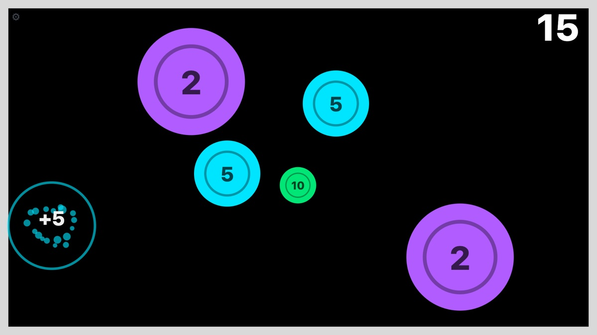

# Wall Target Pong

**Turn any wall into an interactive ball game with a projector and a phone.**
Targets appear on the wall; hit them with a table tennis ball and they burst and score.
The phone's camera tracks the ball, and the phone draws the game, all in one web page.
No app to install, no server, no special hardware.

**▶ Play now: https://yvain13.github.io/TableT/**



A do-it-yourself take on the "interactive ball wall" you see in play centres, built from things
you probably already own. Good for table tennis practice, kids' active play, or a party game.
It runs entirely in the browser, using classic computer vision with no AI model.

---

## What you need

| Item | Notes |
| --- | --- |
| A projector | Any projector that can show your phone's screen. A wired (HDMI) connection gives the lowest delay |
| A phone or tablet with a camera | iPhone, iPad or Android. It shows the game and its rear camera watches the wall |
| A way to get the phone's screen onto the projector | USB-C/Lightning-to-HDMI adapter (best), or the projector's built-in screen mirroring (adds some delay) |
| Orange table tennis balls | Orange is what the tracker looks for. White balls won't work |
| A plain, flat wall | Light-coloured and smooth is best |
| Somewhere to put the phone up high | Shelf, tripod or mount, behind the players and facing the wall |

Keep the phone **charging** while you play. The camera and screen running together drain the
battery, and a hot phone slows its camera down.

## Set up in 5 minutes

1. **Put the projector and phone up high, behind where the players stand,** both facing the
   target wall. Next to each other near the ceiling is ideal (see
   [Camera placement](#camera-placement)).
2. **Connect the phone to the projector** and mirror the screen. Turn the projector's keystone
   correction off.
3. **Open https://yvain13.github.io/TableT/** on the phone, turn it sideways, and allow camera access.
   - iPhone/iPad: Share → **Add to Home Screen**, then open it from there for true full screen.
   - Android (Chrome): it goes full screen by itself; "Add to Home screen" also works.
4. **Tap Calibrate.** The wall goes black, then shows 4 green dots. The app finds them and
   lines the camera up with the projection. If it can't find them, tap the 4 dots in the camera
   view when asked. Check that the green grid sits on the cyan grid, then tap **Looks right: play**.
5. **Open Settings (⚙, top-left) and set "Projected width"** to the measured width of the
   picture on your wall. Target sizes come from this.
6. **Play.**

Calibration is saved. Next time, just open the app and tap **Play**. Recalibrate if the phone
or projector gets bumped.

## How to play

- Hit circles **inside the white frame** with the ball.
- Smaller circles are worth more. Each value always has the same size and colour:

  | Circle | Size on the wall | Points |
  | --- | --- | --- |
  | Green, small | 11 cm | 10 |
  | Cyan, medium | 20 cm | 5 |
  | Purple, large | 35 cm | 2 |

- A hit circle bursts and a new one pops up somewhere else.
- A miss shows a faint ripple where the ball landed, so you can see the tracking working.
- A bounce just outside the frame flashes **OUT** on that edge.
- **Tap the score** to pause or resume. **Hold the score** for a second to reset.

## Camera placement

This matters more than any setting. The app needs to see the ball's path change at the wall,
and some camera positions make that much clearer than others.

**Best: high up (ceiling height), behind the players, seeing the whole projected picture.**
Right next to the projector works well.

From a 3D simulation of a 4 m room:

| Camera position | Bounces caught (30 fps) | 9 in 10 hits within (30 fps) | At 60 fps |
| --- | --- | --- | --- |
| Behind the players, chest height | about half | 2.3 cm | about 0.5 cm |
| Behind the players, ceiling height | about 9 in 10 | 2.0 cm | about 0.5 cm |
| Side wall, about 45° to the wall | all | 6.5 cm | about 1.5 cm |

Also:
- **Some room light helps.** In the dark the ball stops looking orange and the camera's frame
  rate drops. Keep the room dim enough that the projection is visible.
- Keep **ceiling fans** out of the camera's view, or turn them off.
- Players shouldn't stand between the camera and the wall for long.

## Settings and fine-tuning

Open **⚙ Settings** during play. The live camera view (shown in grey) marks the wall outline,
the pixels the tracker thinks are the ball (cyan), the ball's trail (white) and the last hit
(purple). Readouts show the camera resolution, frames per second, processing time per frame and
the reason for the last rejected bounce.

For normal play, keep **Test mode** and **Show ball dot on wall** off.

| Problem | Try |
| --- | --- |
| Frames/s shows 30 or less | Keep "Camera: prefer 60 fps" on, plug in the charger, add some room light, turn off Low Power Mode |
| Hits land a little away from where the ball hit | Raise the camera (see above). Turn on "Show ball dot on wall", hold the ball on the wall at the corners and centre: if the dot is off, recalibrate |
| Bounces are missed | Lower **Min move** to 4 and **Min blob size** to 4. Check the ball shows cyan in the camera view |
| Hits appear with no ball (shadows, arms, clothes) | Raise **Motion threshold** (0.15–0.2) and **Min saturation** (0.55+). Avoid orange clothing |
| Paddle hits count as wall hits | Keep **Size check** on |
| The burst feels late | Use the projector's "game" or low-delay picture mode, and a cable rather than wireless mirroring. Measure the delay with the **Projector lag timer** on the Start screen |
| Auto calibration fails | Dim the room a little, make sure the camera sees all 4 corners, or tap the dots by hand |

**Test mode** (tap = hit) and **Try without a camera** on the Start screen let you try the game
with no ball or camera.

## Works on

| Device | Status |
| --- | --- |
| iPhone with Safari or Chrome | Tested: 60 fps at 640×360 with the 60 fps setting on |
| iPad | Supported (the original target device) |
| Android with Chrome | Should work (same web features); not yet tested on a real device |
| Laptop + USB webcam + projector | Works: it's just a web page |

The page needs HTTPS for camera access (GitHub Pages provides it). After the first visit it
also works offline.

**Privacy:** camera frames are processed on the device and never sent anywhere. There's no
server, no account and no tracking.

## How it works

Everything runs on the phone, in plain JavaScript:

1. **Calibration:** the app projects a black frame, then 4 green dots, and finds the dots in the
   camera image. From their positions it works out the mapping from camera pixels to wall
   positions (a homography) and saves it.
2. **Finding the ball**, every camera frame:
   - Look for pixels that are orange and have just become more orange.
   - Orangeness is measured as a colour ratio, so shadows (which only change brightness) are ignored.
   - Take the densest cluster of those pixels as the ball and map it to the wall.
   - This takes about 2–3 ms per frame on a phone.
3. **Detecting a bounce:** the ball looks smallest when it touches the wall (that's when it's
   farthest from the camera). When its path or speed changes sharply right there, that's a
   bounce. The exact hit point is where the path in and the path out meet in time, so no frame
   needs to catch the moment of contact. Turns where the ball looks *bigger* (paddle hits) and
   turns outside the wall (floor bounces) are ignored.
4. **Game:** the hit point is tested against the circles, and the burst and score are drawn
   on a canvas that the projector shows.

| File | Job |
| --- | --- |
| `js/camera.js` | Rear camera, 60 fps preferred; one callback per new frame (slow frames are dropped, never queued) |
| `js/calibration.js` | Dot projection, dot finding, corner order, tap fallback, grid check |
| `js/homography.js` | Camera-to-wall mapping maths |
| `js/tracker.js` | Orange-pixel detection and ball position |
| `js/bounce.js` | Bounce detection and hit point |
| `js/game.js` | Targets, scoring, boundary, animations |
| `js/settings.js` | Tuning panel |
| `js/app.js` | Wires everything together |

No framework, no build step and no dependencies.

## Run your own copy

**Fork and host:** fork this repo, then in your fork go to Settings → Pages → Deploy from a
branch → `main` / `(root)`. Your copy will be at `https://<you>.github.io/<repo>/`. Any static
host (Netlify, Cloudflare Pages…) works too.

**Develop locally:**

```sh
python3 -m http.server 8000         # http://localhost:8000 (camera works on localhost)
npm test                            # unit tests (Node 18+), no install needed
```

To test on a phone during development, the page must be served over HTTPS, for example with
`npx cloudflared tunnel --url http://localhost:8000`. Add `?debug` to the URL to get
`window.wtp` (game, tracker, bounce, camera) in the browser console.

After changing files, bump `VERSION` in `sw.js` so phones pick up the new version instead of
the cached copy.

## Ideas for later

- Multiplayer: take turns, then one ball colour per player
- Game modes: timed rounds, moving targets, combos, targets that shrink as you score
- Sound effects
- Start and restart by hitting a projected button, so a ceiling-mounted phone never needs touching
- A native app reading the camera at 120 fps, for hard smashes

Issues and pull requests are welcome, especially test reports from Android phones and
different projectors.
